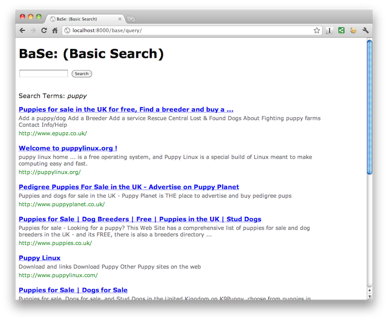
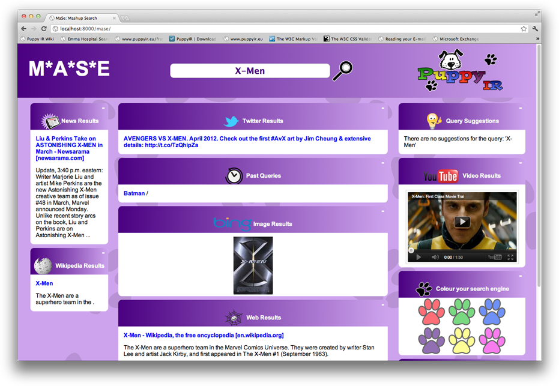

.. _prototypes:

Running Prototypes
========================

Several prototype services are available as examples of how children's information services can built using the framework.

* **aMuSeV2**: a child friendly Multimedia Search engine mash-up search service allowing YouTube, Bing Image and Picassa to be searched for videos and images.
* **aMuSeV3**: a child friendly search service allowing for the retrieving of video & image search results and the exploration of these results via the generation of new queries.
* **BaSe**: Basic Search - a bare bones search service with no frills.
* **IfSe**: Information Foraging Search - an application created as a tutorial (see: :ref:`information-foraging-puppyir-tutorial`) for using the PuppyIR framework to create a pipeline.
* **MaSe**: Multimedia Search Engine Mash-up: an application created as a tutorial (see: :ref:`mase-mash-up-search-engine-puppyir-tutorial`) for using PuppyIR to create a customisable web application and in doing so, introduce web programming to school children.
* **SeSu**: Search and Suggest - a search service which filters results by their suitability for children as well as providing search suggestions for new queries.

Downloading the Prototypes
--------------------------

All the prototypes require Django to be installed to use them. If you do not have Django installed, then please visit the :ref:`requirements_and_installation` page and install them before downloading the prototypes.

In addition, IfSe and MaSe also require Whoosh to be installed to use them, if you do not have Whoosh installed please visit the installation page, as detailed above, and install Whoosh.

The source code for all the prototype services can then be downloaded as follows:

:: 

  $ svn co https://puppyir.svn.sourceforge.net/svnroot/puppyir/trunk/prototypes prototypes

To download a specific prototype, use the command as follows substituting in the name of the application (in this case, you will need to amend the paths to run the prototypes by removing the 'prototypes' part of the path as noted in the **run** sections of this page):

::

  $ svn co https://puppyir.svn.sourceforge.net/svnroot/puppyir/trunk/prototypes/<APPNAME> <APPNAME>
  

Using aMuSeV2: a Multimedia Search engine mash-up
-------------------------------------------------

aMuSeV2 allows video and picture results to be retrieved from YouTube, Bing and Picassa. The results are then scaled according to relevance; all results are draggable allowing them to be arranged as the user wishes.

.. figure::  images/puppy-amuse.png
   :align:   center

   *aMuSeV2 showing a video/image collage of 'Thomas the Tank Engine' results.*

Run aMuSeV2
***********

::

  $ cd /path/to/prototypes/amuseV2
  $ python manage.py runserver

Visit: http://localhost:8000/amuse

Using aMuSeV3: a Multimedia Search engine mash-up and browsing application
--------------------------------------------------------------------------

aMuSeV3 allows video and picture results to be retrieved from YouTube and Bing image search. The results are then, randomly (albeit, with a left-right-top-bottom approximation of relevance), arranged in a collage of images and videos. Videos can be played in-line; clicking on an image will generate a new query which will return a new collage of results.

aMuSeV3 is only compatible with Python Version 2.7 - if you have an earlier version then please install Python 2.7 to use this prototype.

.. figure::  images/puppy-amuseV3.png
   :align:   center

   *aMuSeV3 showing a video/image collage of 'Batman' results.*

Run aMuSeV3
***********

::

  $ cd /path/to/prototypes/amuseV3
  $ python manage.py runserver

Visit: http://localhost:8000/amuse

Using BaSe: Basic Search
------------------------

This is a simple 'google-like' interface to illustrate a simple search interface.

   *BaSe running on a local machine showing web results for the query 'puppy'.*

Run BaSe
********

::

  $ cd /path/to/prototypes/base-tutorial
  $ python manage.py runserver

Visit: http://localhost:8000/base

Using IfSe: Information Foraging Search
---------------------------------------

This prototype is part of a tutorial (see: :ref:`information-foraging-puppyir-tutorial`) that teaches how to go about retrieving results from search engine wrappers, logging queries, generating suggestions and how to filter queries.

.. figure::  images/puppy-ifse-before.png
   :align:   center

   *IfSe running on a local machine showing web results for the query 'puppy'.*

Run IfSe
********

::

  $ cd /path/to/prototypes/ifse-tutorial
  $ python manage.py runserver

Visit: http://localhost:8000/ifse

Using MaSe: Multimedia Mash-up Search Engine
-----------------------------------------------

MaSe is an application designed to allow children to create and customise their own search engine - retrieving results from a variety of sources and formats. See the MaSe tutorial for more details about the application :ref:`mase-mash-up-search-engine-puppyir-tutorial`.

   *MaSe running on a local machine showing web results for the query 'X-Men'.*

Run MaSe
********

::

  $ cd /path/to/prototypes/mase-tutorial
  $ python manage.py runserver

Visit: http://localhost:8000/mase

Using SeSu: Search and Suggest
--------------------------------------------

SeSu is a prototype service that investigates query suggestions and suitability filters for children's web search.

   *SeSu showing results, with their suitability rating, for a query about the news.*

Run SeSu
********

::

  $ cd /path/to/prototypes/sesu
  $ python manage.py runserver

Visit: http://localhost:8000/sesu